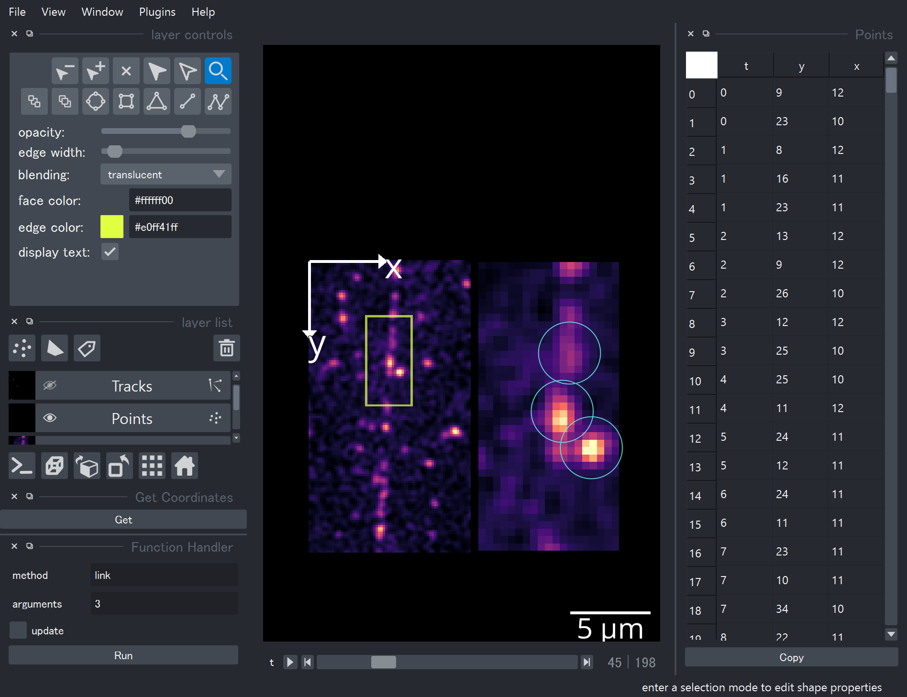
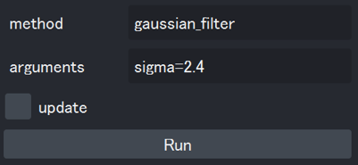
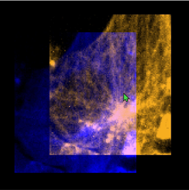
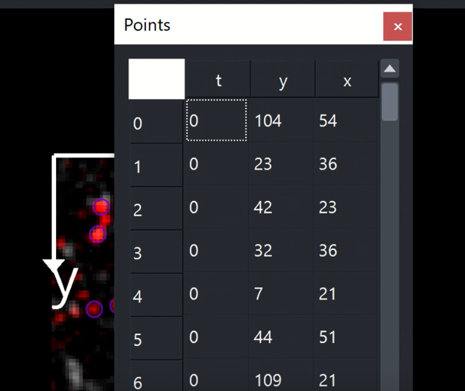

# impy

## More Numpy in Image Analysis! 



[scikit-image](https://github.com/scikit-image/scikit-image) is very useful but sometimes troublesome like ...

1. for multi-dimensional images, you need to check which is time-axis and which is channel axis and so on.
2. you need to consider the output data types and shapes for every batch image processing.
3. you need to care about all the images' information such as the names and directories of original images.

With `ImgArray` and its relatives, this module solves major problems above.


## Installation

```
pip install git+https://github.com/hanjinliu/impy
```

For full usage of `impy` you also need to install `napari` and `trackpy`.

## Highlights

#### 1. Handling Axes Easily
**Image axes/scales are automatically read** from TIFF file and arrays support **axis-targeted slicing** like:
```python
img["t=3;z=5:7"]
img["y=3,5,7"] = 0
```
Accordingly, broadcasting is more flexible. You can also set your original axes symbol if you like, by such as `img.axes = "!yx"`.

#### 2. Automatic Batch Processing
Almost all the image processing functions can **automatically iterate** along all the axes needed. If you want to run batch Gaussian filter on a image hyperstack, just call `img.gaussian_filter()`, and the filtering function considers zyx-axes as a spatially connected dimensions and is repeated for every rest of axis like t, c. Check [Image Analysis Tools](#image-analysis-tools) for available functions.

You can even run batch processing **with your own functions** by decorating them (`@ip.bind`). See [Integrating Your Own Functions](#integrating-your-own-functions) part.
   
#### 3. Metadata and History
All the information, history and metadata are inherited to outputs, like:

```python
img
```
```
    shape     : 10(t), 20(z), 256(y), 256(x)
  label shape : No label
    dtype     : uint16
  directory   : ...\images
original image: XXX
    history   : gaussian_filter(sigma=1)
```

#### 4. Image Viewer

You can view images with `matplotlib` of course, but this module also provides seamless interface between [napari](https://github.com/napari/napari), a great image visualization tool. Image axes and other information are utilized before sending to `napari.Viewer`, so that you don't need to care about keyword arguments and what function should be called.

You can also **manually crop or label** `ImgArray` with `napari`'s `Shapes` objects, or **run impy functions inside the viewer**. I also implemented useful custom keybindings and widgets. See [Napari Interface](#napari-interface) for details.

#### 5. Extended Numpy Functions
In almost all the numpy functions, the keyword argument `axis` can be given as the symbol of axis like:

```python
np.mean(img, axis="z") # Z-projection
np.stack([img1, img2], axis="c") # color-merging
```

This is achieved by defining `__array_function__` method. See [here](https://numpy.org/devdocs/reference/arrays.classes.html) for details.

You can also make an `ImgArray` in a way similar to `numpy`:

```python
ip.array([2,4,6], dtype="uint16")
ip.random.normal(size=(100, 100))
```

## Contents

- `ImgArray` is an array mainly used for image analysis here. Many `skimage`'s functions are wrapped in this class.
- `PropArray` is an array that contains properties of another array, such as mean intensities of fixed regions of an array. 
- `Label` is also an array type while it is only used for labeling of another image and is always attached to it. 
- `PhaseArray` is an array that contains phase values. Unit (radian or degree) and periodicity are always tagged to itself so that you don't need to care about them. 
- `MarkerFrame` is a subclass of `pandas.DataFrame` and it is specialized in storing coordinates and markers, such as xyz-coordinates of local maxima. This class also supports axis targeted slicing `df["x=4;y=5"]`. Tracking methods are also available, which call [trackpy](https://github.com/soft-matter/trackpy) inside.
- `TrackFrame` is quite similar to `MarkerFrame` while it is only retuned when points are linked by particle tracking. It has information of track ID.
- `gui` is a controller object that connects console and `napari.Viewer`.

## Image Analysis Tools

`ImgArray` has a lot of member functions for image analysis. Some of them supports multiprocessing.

- **Drift/Aberration Correction**
  - `track_drift`, `drift_correction` &rarr; Correction of xy-drift.
  - `affine_correction` &rarr; Correction of such as chromatic aberration using Affine transformation.

- **2D/3D Deconvolution**
  - `wiener`, `lucy` &rarr; Classical Wiener's and Richardson-Lucy's algorithm.
  - `lucy_tv` &rarr; Richardson-Lucy's algorithm with total variance (TV) regularization.

- **Filters**
  - `mean_filter`, `meadian_filter`, `gaussian_filter`, `directional_median_filter` &rarr; Smoothing.
  - `dog_filter`, `doh_filter`, `log_filter` &rarr; Blob detection by DoG, DoH, LoG filter.
  - `edge_filter`, `laplacian_filter` &rarr; Edge detection.
  - `std_filter`, `coef_filter` &rarr; Standard deviation based filtering.
  - `lowpass_filter`, `highpass_filter` &rarr; FFT based filtering.
  - `entropy_filter`, `enhance_contrast`, `gabor_filter` &rarr; Object detection etc.
  - `kalman_filter`, `wavelet_denoising`, `rof_filter` &rarr; Advanced denoising methods.

- **Morphological Image Processing**
  - `erosion`, `dilation`, `opening`, `closing` &rarr; Basic ones.
  - `area_opening`, `area_closing`, `diameter_opening`, `diameter_closing` &rarr; Advanced ones.
  - `skeletonize`, `fill_hole` &rarr; Binary processing.
  - `count_neighbors` &rarr; For structure detection in binary images.
  - `remove_large_objects`, `remove_fine_objects` `remove_skeleton_structure` &rarr; Detect and remove objects.

- **Single Molecule Detection**
  - `find_sm`, `peak_local_max` &rarr; Return coordinates of single molecules.
  - `centroid_sm`, `gauss_sm`, `refine_sm` &rarr; Return coordinates in subpixel precision.

- **Background/Intensity Correction**
  - `rolling_ball`, `tophat` &rarr; Background subtraction.
  - `gaussfit`, `gauss_correction` &rarr; Use Gaussian for image correction.
  - `unmix` &rarr; Unmixing of leakage between channels.

- **Cololalization Analysis**
  - `pearson_coloc` &rarr; Pearson's correlation coefficient.
  - `manders_coloc` &rarr; Manders' correlation coefficient.
  
- **Labeling**
  - `label`, `label_if`, `label_threshold` &rarr; Labeling using binary images.
  - `specify` &rarr; Labeling around coordinates.
  - `append_label` &rarr; Label images.
  - `expand_labels`, `watershed`, `random_walker` &rarr; Adjuct or segment labels.

- **Feature Detection**
  - `hessian_eigval`, `hessian_eig` &rarr; Hessian.
  - `structure_tensor_eigval`, `structure_tensor_eig` &rarr; Structure tensor.
  - `ncc`, `track_template` &rarr; Template matching and tracking.

- **Gradient Orientation Estimation**
  - `edge_grad`

- **Filament Orientation Estimation**
  - `hessian_angle` &rarr; Using Hessian eigenvector's orientations.
  - `gabor_angle` &rarr; Using Gabor filter's responses.

- **Property Measurement**
  - `regionprops` &rarr; Measure region properties such as mean intensity, Euler number, centroid, moment etc.
  - `pathprops` &rarr; Measure path properties such as mean intensity.
  - `lineprops`, `pointprops` &rarr; Measure line/point properties.

- **Texture Classification**
  - `lbp`, `glcm`, `glcm_props`

- **Others**
  - `focus_map` &rarr; Find focus using variance of Laplacian method. 
  - `stokes` &rarr; Analyze polarization using Stokes parameters.
  - `fft`, `ifft` &rarr; Fourier transformation.
  - `threshold` &rarr; Thresholding (many methods included).
  - `reslice` &rarr; Get scan along a line or path.
  - `crop_center`, `crop_kernel`, `remove_edges` &rarr; Crop image.
  - `clip`, `rescale_intensity` &rarr; Rescale the intensity profile into certain range.
  - `proj` &rarr; Z-projection along any axis.
  - `split`, `split_pixel_unit` &rarr; Split the image.
  - `pad`, `defocus` &rarr; Padding.
  - `iter`, `for_each_channel` &rarr; Easy iteration.
  - `set_scale` &rarr; set scales of any axes.
  - `imshow` &rarr; visualize 2-D or 3-D image with `matplotlib`.
  - `imsave` &rarr; save image (by default save in the directory that the original image was loaded).

## Image I/O and Other Functions

- `impy.imread` &rarr; Load an image. `e.g. >>> ip.imread(path)`
- `impy.imread_collection` &rarr; Load images recursively as a stack. `e.g. >>> ip.imread_collection(path, ignore_exception=True)`
- `impy.imread_stack` &rarr; Load images as a stack if file paths follows certain rules like `"...\10nM_pos0"`, `"...\10nM_pos1"`, ..., `"...\50nM_pos3"`.
- `impy.read_meta` &rarr; Read metadata of a tiff file.


... and many `numpy` functions are also accessible with such as `ip.array` or `ip.random.normal`.


## Napari Interface

`impy.gui` has methods for better interface between images and `napari`.

- Add any objects (images, labels, points, ...) to the viewer by `ip.gui.add(...)`.
- Return all the manually selected layers' data by `layers = ip.gui.selection`.
- Run `ImgArray`'s method inside viewers like below.
  
  

- Select viewers or create a new viewer by such as `ip.gui["viewer_name"].add(...)`.
- Translate and rescale layers with mouse.
  - `Alt` + mouse drag &rarr; lateral translation
  - `Alt` + `Shift` + mouse drag &rarr; lateral translation restricted in either x- or y-orientation (left button or right button respectively).
  - `Alt` + mouse wheel &rarr; rescaling
  - `Ctrl` + `Shift` + `R` &rarr; reset original states.

  

- Fast layer selection and manipulation.
  - `Ctrl` + `Shift` + `A` &rarr; Hide non-selected layers. Display all the layers by push again.
  - `Ctrl` + `Shift` + `F` &rarr; Move selected layers to front.
  - `Alt` + `L` &rarr; Convert all the shapes in seleted shape-layers into labels of selected image-layers.
  - `Ctrl` + `Shift` + `X` &rarr; Crop selected image-layers with all the rectangles in selected shape-layers.
  - `Ctrl` + `P` &rarr; Projection of shape-layers or point-layers to 2D layers.
  - `Ctrl` + `G` / `Ctrl` + `Shift` + `G` &rarr; Link/Unlink layers. Like "grouping" in PowerPoint.
- Show coordinates of selected point-layers or track-layers. You can also copy it to clipboard.
  
  

- Note pad in `Window > Note`.
- Call `impy.imread` in `File > imread ...`.

`napari` is now under development itself so I'll add more and more functions (I'm especially looking forward to grouping image layers).

## Integrating Your Own Functions

`ImgArray` is designed highly extensible. With `impy.bind`, You can easily integrate functions that converts:

- image &rarr; image (image filtering, thresholding etc.)
- image &rarr; scalar (measuring/estimating properties)
- image &rarr; label (feature detection, image segmentation etc.)

Suppose you want to use `imfilter`, a image filtering function that works on float images, for batch processing of multi-dimensional images. Just write

```python
import impy as ip
@ip.bind(indtype="float32")
def imfilter(img, param=None):
    # do something for a 2D or 3D image.
    return out
```

or

```python
ip.bind(imfilter, indtype="float32")
```

or in with-block for temporary usage

```python
with ip.bind(imfilter, indtype="float32"):
    ...
```

and now it's ready to execute batch-`imfilter`!

```python
img = ip.imread(r"...\images\XXX.tif")
img.imfilter(param=3)
```

This function is also accessible inside `napari` viewers.
