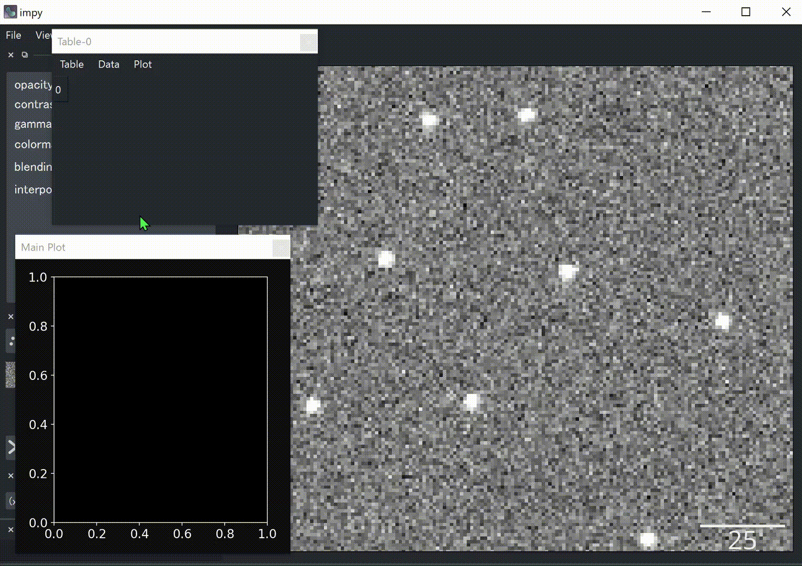

# `impy` is All You Need in Image Analysis

`impy` is an all-in-one image analysis library, equipped with parallel processing, GPU support, GUI based tools and so on.

The core array, `ImgArray`, is a subclass of `numpy.ndarray`, tagged with information such as 
- image axes
- scale of each axis
- directory of the original image
- history of image processing 
- and other image metadata

By making full use of them, `impy` provides super efficient tools of image analysis for you. 

I'm also working on [documentation](https://hanjinliu.github.io/impy/) for tutorials and API. Please take a look if you're interested in.

### Code as fast as you speak

Almost all the functions, such as filtering, deconvolution, labeling, single molecule detection, and even those pure `numpy` functions, are aware of image metadata. They "know" which dimension corresponds to `"z"` axis, which axes they should iterate along or where to save the image. As a result, **your code will be very concise**:

```python
import impy as ip
import numpy as np

img = ip.imread("path/to/image")       # Read images with metadata.
img["z=3;t=0"].imshow()                # Plot image slice at z=3 and t=0.
img_fil = img.gaussian_filter(sigma=2) # Paralell batch denoising. No more for loop!
img_prj = np.max(img_fil, axis="z")    # Z-projection (numpy is aware of image axes!).
img_prj.imsave(f"Max-{img.name}")      # Save in the same place. Don't spend time on searching for the directory!
```

### Seamless interface between `napari`

[napari](https://github.com/napari/napari) is an interactive viewer for multi-dimensional images. `impy` has a **simple and efficient interface** with it, via the object `ip.gui`. Since `ImgArray` is tagged with image metadata, you don't have to care about axes or scales. Just run 

```python
ip.gui.add(img)
```

`impy`'s viewer also provides **many useful widgets and functions** such as 

- Excel-like table for data analysis, layer property editing etc.
- Compact file explorer
- interactive `matplotlib` figure canvas
- cropping, duplication, measurement, filtering tools

### Extend your function for batch processing

Already have a function for `numpy`? Decorate it with `@ip.bind` 

```python
@ip.bind
def imfilter(img, param=None):
    # Your function here.
    # Do something on a 2D or 3D image and return image, scalar or labels
    return out
```
and it's ready for batch processing!

```python
img.imfilter(param=1.0)
```

### Making plugin is easy

Image analysis usually relies on manual handling, which has been discoraging people from programatic analysis on their data. But now, with `@ip.gui.bind` decorator, make plugin by yourself!

```python
import matplotlib.pyplot as plt
from skimage.measure import moments

@ip.gui.bind
def func(gui): # the first argument will be ip.gui
    img = gui.get("image") # Get the front image
    y, x = gui.viewer.cursor.position # Get cursor position
    y0 = int(y-5)
    x0 = int(x-5)
    img0 = img[y0:y0+11, x0:x0+11] # Get 11x11 region around cursor

    # Calculate centroid.
    M = moments(img0.value)
    cy, cx = M[1, 0]/M[0, 0], M[0, 1]/M[0, 0]

    # Plot centroid.
    plt.figure()
    plt.imshow(img0, cmap="gray")
    plt.scatter([cx], [cy], s=360, color="crimson", marker="+")
    plt.text(cx+0.5, cy+0.5, f"({cx+x0:.1f}, {cy+y0:.1f})", size="x-large", color="crimson")
    plt.title("Centroid")
    plt.show()
    
    # Append centroid to table widget.
    gui.table.append([cy+y0, cx+x0])
    return
```




## Installation

```
pip install git+https://github.com/hanjinliu/impy
```

or

```
git clone https://github.com/hanjinliu/impy
```

## Depencencies

- `scikit-image`>=0.18
- `numpy`>=1.17
- `scipy`>=1.6.3
- `matplotlib`>=3.3.4
- `pandas`>=1.3.1
- `dask`>=2021.6.0
- `tifffile`>=2021.6.14
- `napari`>=0.4.11
  
`impy` is partly dependent on `numba`, `cupy`, `trackpy` and `dask-image`. Please install these packages if needed. 

:warning: Image processing algorithms in `ImgArray` are almost stable so that their behavior will not change a lot. However, since `napari` is under development and I'm groping for better UI right now, any functions that currently implemented in `impy` viewer may change or no longer work in the future. Make sure keeping `napari` and `impy` updated when you use.

