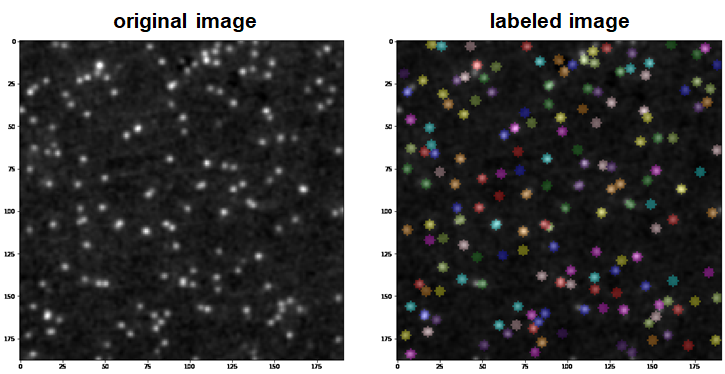

# impy

## More Numpy in image analysis! 

```python
import impy as ip
img = ip.imread(r"...\images\Image_0.tif")
peaks = img.find_sm(percentile=90)
img.specify(center=peaks, radius=3, labeltype="circle")
img.imshow()
img.imshow_label()
```



ImageJ is generally used for image analysis especially in biological backgrounds. However, recent demands for batch analysis, machine learning and high reproducibility are usually hard to achieve with ImageJ. On the other hand, the famous image analysis toolkit, [scikit-image](https://github.com/scikit-image/scikit-image), is not suited for biological image analysis because many functions do not support standard multi-dimensional tiff files.

Here with `ImgArray`, this module solved major problems that happens when you code image analysis in Python. Because axial information such as xy plane, channels and time are also included in the arrays, many functions can automatically optimize multi-dimensional image analysis such as filtering, background subtraction and deconvolution. For other purposes, such as labeling and storing propeties of an image, `Label`, `PropArray` are alternatively returned but they also support basic functions as `ImgArray`.

This module also provides many image analysis tools and seamless interface between [napari](https://github.com/napari/napari), which help you to operate with and visualize images, and [trackpy](https://github.com/soft-matter/trackpy), which enables efficient molecule tracking.

## Brief Examples

#### 1. Input/Output and Visualization

```python
import impy as ip
img = ip.imread(r"...\images\XXX.tif")
img.gaussian_filter(sigma=1, update=True)
img.imsave("image_name")
```

```python
img.imshow() # matplotlib based visualization
ip.window.add(img) # send to napari
```

#### 2. Metadata and Axis-Targeted Slicing

Suppose an `np.ndarray` with shape (10, 20, 256, 256), which axis is time and which is z-slice? The file path of original image, what analysis have been applied are also confusing. `ImgArray` retains all the axis information and histories. You can use any character as axis symbols.

```python
img
```

    [Out]
        shape     : 10(t), 20(z), 256(y), 256(x)
      label shape : No label
        dtype     : uint16
      directory   : ...\images
    original image: XXX
       history    : gaussian_filter(sigma=1)

You can also access any parts of image with string that contains axis information.

```python
img_new = img["z=1;t=4,6,8"]
img_new.axes = "p*@e"
```

#### 3. Axis-Targeted Iteration

Usually we want to iterate analysis along random axes. `ImgArray` has `iter` method that simplify this process, which is similar to `groupby` function in `pandas`:

```python
for sl, img2d in img.iter("tzc"): # iterate along t, z and c axis
    # Here, img[sl] == img2d
    print(img2d.range) # do something
```

which is equivalent to something like ...

```C
for (t in t_all) {
    for (z in z_all) {
        for (c in c_all) {
            print(min(img[t,z,c]), max(img[t,z,c]))
        }
    }
}
```

#### 4. Labeling and Measurement

`scikit-image` has a powerful measurement function called `regionprops`. `ImgArray` also has a method that wrapped the `regionprops` function while enables multi-measurement.

```python
img.label_threshold(thr="yen") # Label image using Yen's thresholding
props = img.regionprop(properties=("mean_intensity", "perimeter")) # Measure mean intensity and perimeter for every labeled region
props.perimeter.p() # Plot results of perimeter
props.perimeter["p=10;t=2"] # Get the perimeter of 10-th label in the slice t=2.
```

## Basic Functions in impy

Load image with `imread()` function. `ImgArray` object is created.

- `imread` = Load an image. `e.g. >>> ip.imread(path)`
- `imread_collection` = Load images recursively as a stack. `e.g. >>> ip.imread_collection(path, ignore_exception=True)`
- `read_meta` = Read metadata of a tiff file.
- `array`, `zeros`, `zeros_like`, `empty`, `empty_like` = similar to those in `numpy` but return `ImgArray`.
- `set_cpu` = Set the numbers of CPU used in image analysis.
- `stack` = Make a image stack from a list of images along any axis. ` e.g. >>> ip.stack(imglist, axis="c")`

## Attributes and Methods of ImgArray

### Attributes

- `name` &rarr; name of the original image.
- `dirpath` &rarr; absolute path to the original image.
- `history` &rarr; history of applied analysis.
- `axes` &rarr; dimensions of image, `ptzcyx`-order.
- `scale` *property* &rarr; scales of each axis.
- `value` *property* &rarr; show the array in numpy format.
- `range` *property* &rarr; return a tuple of min/max of the image.
- `spatial_shape` *property* &rarr; such as `"yx"` or `"zyx"`.

### Basic Functions

- `imshow` &rarr; visualize 2-D or 3-D image.
- `imshow_label` &rarr; visualize 2-D or 3-D image and its labels.
- `imshow_comparewith` &rarr; compare two 2-D images.
- `hist` &rarr; show the histogram of image intensity profile.
- `imsave` &rarr; save image (by default save in the directory that the original image was loaded).
- `set_scale` &rarr; set scales of any axes.
- `window` &rarr; interface between `napari`. `ImgArray`, `Label`, `MarkerFrame` and `TrackFrame` can be sent to viewer with a simple code `ip.window.add(X)`.

## Data Type Conversion

`uint8`, `uint16`, `bool` and `float32` are supported for type conversion.
- `as_uint8` &rarr; convert to `uint8`.
- `as_uint16` &rarr; convert to `uint16`.
- `as_float` &rarr; convert to `float32`.
- `as_img_type` &rarr; convert to any supported types.

## Automatic Saturation and Type Conversion

Overflow, underflow and type conversion is considered for operations `+`, `-`, `*` and `/`.
```python
# img = <uint16 image>

img + 10000     # pixel values larger than 65535 is substituted to 63353

img - 10000     # pixel values smaller than 0 is substituted to 0

img / 10        # output is converted to float32 
```

## Image Analysis

`ImgArray` has a lot of member functions for image analysis. Some of them supports multiprocessing.

- `track_drift`, `drift_correction` &rarr; Automatic drift correction.
- `wiener`, `lucy` &rarr; Deconvolution of images.
- `pad`, `defocus` &rarr; Effective padding.
- `affine_correction` &rarr; Correction of such as chromatic aberration using Affine transformation.
- `focus_map` &rarr; Find focus using variance of Laplacian method. 
- `hessian_eigval`, `hessian_eig` &rarr; Feature detection using Hessian method.
- `structure_tensor_eigval`, `structure_tensor_eig` &rarr; Feature detection using structure tensor.
- `dog_filter`, `doh_filter`, `log_filter` &rarr; Blob detection.
- `mean_filter`, `meadian_filter`, `gaussian_filter` &rarr; n-dimensional smoothing.
- `std_filter`, `coef_filter` &rarr; Standard deviation based filtering.
- `sobel_filter`, `laplacian_filter` &rarr; Edge detection.
- `entropy_filter` &rarr; Object detection.
- `enhance_contrast` &rarr; Enhancing contrast.
- `erosion`, `dilation`, `opening`, `closing` &rarr; Morphological processing.
- `rolling_ball`, `tophat` &rarr; Background subtraction.
- `convolve` &rarr; Any convolution.
- `gaussfit` &rarr; Fit the image to 2-D Gaussian.
- `distance_map`, `skeletonize`, `fill_hole`, `count_neighbors` &rarr; Processing binary images.
- `fft`, `ifft` &rarr; Fourier transformation.
- `threshold` &rarr; Thresholding (many methods included).
- `find_sm`, `peak_local_max`, `corner_peaks` &rarr; Find maxima.
- `centroid_sm`, `gauss_sm` &rarr; Find single molecule in subpixel precision.
- `label`, `label_threshold`, `specify` &rarr; Label images.
- `expand_labels`, `watershed` &rarr; Adjuct labels.
- `regionprops` &rarr; Measure properties on labels.
- `reslice` &rarr; Get line scan.
- `crop_center` &rarr; Crop image.
- `clip`, `rescale_intensity` &rarr; Rescale the intensity profile into certain range.
- `proj` &rarr; Z-projection along any axis.
- `split` &rarr; Split the image along any axis.

# References
For deconvolution, function `lucy` from Julia-coded package [Deconvolution.jl](https://github.com/JuliaDSP/Deconvolution.jl) is translated into Python.
