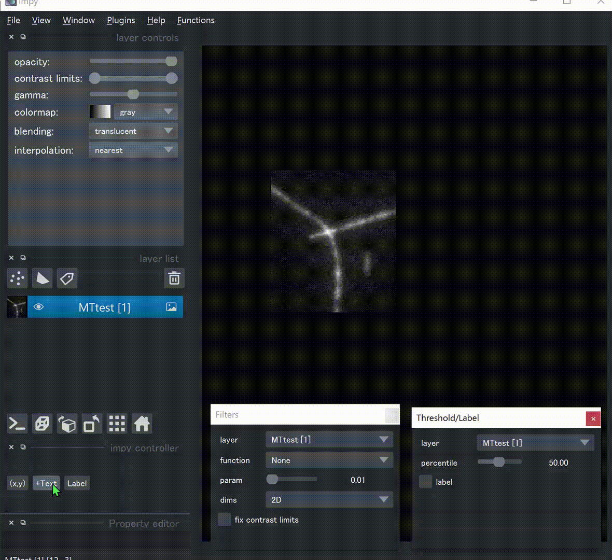

# impy

Image analysis programatically is sometimes troublesome like ...

1. for multi-dimensional images, you need to check which is time-axis and which is channel axis and so on.
2. you need to consider the output data types and shapes for every batch image processing.
3. you need to care about all the images' information such as the names and directories of original images.
4. hard to edit images interactively.

As a result, isn't it faster to analyze images using ImageJ? This module solves these major problems of Python based image analysis and makes it much more effective.

## Documentation

Please refer to `impy`'s [documentation](https://hanjinliu.github.io/impy/) for tutorials and API.

## Installation

```
pip install git+https://github.com/hanjinliu/impy
```

or

```
git clone https://github.com/hanjinliu/impy
```

## Depencencies

- `scikit-image`>=0.18
- `numpy`>=1.17
- `scipy`>=1.6.3
- `matplotlib`
- `pandas`>=1
- `dask`>=2021.6.0
- `tifffile`>=2021.6.14
- `napari`>=0.4.9
  
`impy` is partly dependent on `numba`, `cupy`, `trackpy` and `dask-image`. Please install these packages if needed. 

## Highlights

#### 1. Handling Axes Easily

**Image axes/scales are automatically read** from file metadata and as a result, arrays support **axis-targeted slicing** like:

```python
img["t=3;z=5:7"]
img["y=3,5,7"] = 0
```

Accordingly, broadcasting is more flexible. ([xarray](https://github.com/pydata/xarray) and [tensor_annotations](https://github.com/deepmind/tensor_annotations) seem similar in this sense)

#### 2. Automatic Batch Processing

Almost all the image processing functions can **automatically iterate along all the axes needed**. If you want to run batch Gaussian filter on a image hyperstack, just call `img.gaussian_filter()`, and the filtering function considers zyx-axes as a spatially connected dimensions and is repeated for every rest of axis like t, c. Prallel image processing is optimized for many function by temporarily converting into `dask` array. Check [Image Analysis Tools](#image-analysis-tools) for available functions.

You can even run batch processing **with your own functions** by decorating them with `@ip.bind`. See [Integrating Your Own Functions](#integrating-your-own-functions) part.

You may usually want to perform same filter function to images with different shapes and dimensions. `DataList` is a `list`-like object and `DataDict` is a `dict`-like object, which can iterate over all the images (or other objects) with `__getattr__` method.

```python
imglist = ip.DataList(imgs)
outputs = imglist.gaussian_filter(sigma=3) # filter is applied to all the images
```

With `for_params` method, you can easily repeat same function with different parameters.

```python
out = img.for_params("gaussian_filter", sigma=range(1,5))
```

#### 3. Metadata and History

All the information, history and metadata are inherited to outputs, like:

```python
img
```
```
    shape     : 10(t), 20(z), 256(y), 256(x)
  label shape : No label
    dtype     : uint16
  directory   : ...\images
original image: XXX
    history   : gaussian_filter(sigma=1)
```

Therefore, results can always be saved in the same directory, without copy-and-pasting paths.

#### 4. Image Viewer

`impy` provides seamless interface between [napari](https://github.com/napari/napari), a great image visualization tool. Image axes and other information are utilized before sending to `napari.Viewer`, so that you don't need to care about keyword arguments and what function should be called. See [Napari Interface](#napari-interface) for more details.

#### 5. Extended Numpy Functions

In almost all the numpy functions, the keyword argument `axis` can be given as the symbol of axis like:

```python
np.mean(img, axis="z") # Z-projection
np.stack([img1, img2], axis="c") # color-merging
```

This is achieved by defining `__array_function__` method. See [here](https://numpy.org/devdocs/reference/arrays.classes.html) for details.

You can also make an `ImgArray` in a way similar to `numpy`:

```python
ip.array([2,4,6], dtype="uint16")
ip.random.normal(size=(100, 100))
```

#### 6. Reading/Processing Images Lazily

When you deal with large images, you may want to read just part of them to avoid waiting too long, or sometimes they are too large for the PC memory to read. In ImageJ there is an option called "virtual stack" but still it is not flexible enough.

In `impy`, there are several ways to efficiently deal with large datasets. See [Image I/O](#image-io) for details.

#### 7. GPU Support

Affine transformation, deconvolution and many filter functions are automatically conducted with GPU if accessible. On importing `impy`, it checks if `cupy` and GPU are correctly installed, so that you don't have to change your code. See [Image Analysis Tools](#image-analysis-tools) for details.

#### 8. Fit Your Function into GUI (WIP)

In image analysis, you usually want to set parameters using manually drawn shapes or points. You don't have to do that by getting properties of the viewer for every function call. Just decorate your function with `@ip.gui.bind` and call function with keybind "F1". You can also plot on the figure canvas inside `napari`. See [Bind Your Function to Napari](#bind-your-function-to-napari) for an example.

## Contents

- **Arrays**
  - `ImgArray` is an array mainly used for image analysis here. Many `skimage`'s functions are wrapped in this class.
  - `PropArray` is an array that contains properties of another array, such as mean intensities of fixed regions of an array. 
  - `Label` is also an array type while it is only used for labeling of another image and is always attached to it. 
  - `PhaseArray` is an array that contains phase values. Unit (radian or degree) and periodicity are always tagged to itself so that you don't need to care about them. 
  - `LazyImgArray` keeps memory map to an image as an `dask` array and you can access image metadata and slice the images without reading them. Some filter functions are supported in `dask-image`.

- **DataFrames**
  - `MarkerFrame` is a subclass of `pandas.DataFrame` and it is specialized in storing coordinates and markers, such as xyz-coordinates of local maxima. This class also supports axis targeted slicing `df["x=4;y=5"]`. Tracking methods are also available, which call [trackpy](https://github.com/soft-matter/trackpy) inside.
  - `TrackFrame` is quite similar to `MarkerFrame` while it is only retuned when points are linked by particle tracking. It has information of track ID.

- **Others**
  - `DataList` and `DataDict` can apply same method to all the data inside it.
  - `gui` is a controller object that connects console and `napari.Viewer`.

## Image Analysis Tools

`ImgArray` has a lot of member functions for image analysis. Some of them supports multiprocessing with `dask`. ":zap:" indicates (partially) GPU support is available. ":maple_leaf:" means also available in `LazyImgArray`.

- **Drift/Aberration Correction**
  - `track_drift`:zap::maple_leaf:, `drift_correction`:zap::maple_leaf: &rarr; Correction of xy-drift.
  - `affine_correction`:zap: &rarr; Correction of such as chromatic aberration using Affine transformation.

- **2D/3D Deconvolution**
  - `wiener`:zap::maple_leaf:, `lucy`:zap::maple_leaf: &rarr; Classical Wiener's and Richardson-Lucy's algorithm.
  - `lucy_tv`:zap: &rarr; Richardson-Lucy's algorithm with total variance (TV) regularization.

- **Filters**
  - `mean_filter`:zap::maple_leaf:, `meadian_filter`:zap::maple_leaf:, `gaussian_filter`:zap::maple_leaf: &rarr; Smoothing.
  - `dog_filter`:zap::maple_leaf:, `doh_filter`:zap:, `log_filter`:zap: &rarr; Blob detection by DoG, DoH, LoG filter.
  - `edge_filter`:maple_leaf:, `laplacian_filter`:zap::maple_leaf: &rarr; Edge detection.
  - `std_filter`:zap:, `coef_filter`:zap: &rarr; Standard deviation based filtering.
  - `lowpass_filter`:zap:, `highpass_filter`:zap: &rarr; FFT based filtering.
  - `entropy_filter`, `enhance_contrast`, `gabor_filter`:zap: &rarr; Object detection etc.
  - `ncc_filter` Template matching etc.
  - `kalman_filter`:zap::maple_leaf:, `wavelet_denoising`, `rof_filter` &rarr; Advanced denoising methods.

- **Morphological Image Processing**
  - `erosion`:zap::maple_leaf:, `dilation`:zap::maple_leaf:, `opening`:zap::maple_leaf:, `closing`:zap::maple_leaf: &rarr; Basic morphology filters.
  - `area_opening`, `area_closing`, `diameter_opening`, `diameter_closing` &rarr; Advanced ones.
  - `skeletonize`, `fill_hole` &rarr; Binary processing.
  - `count_neighbors` &rarr; For structure detection in binary images.
  - `remove_large_objects`, `remove_fine_objects` `remove_skeleton_structure` &rarr; Detect and remove objects.

- **Single Molecule Detection**
  - `find_sm`, `peak_local_max` &rarr; Return coordinates of single molecules.
  - `centroid_sm`, `gauss_sm`, `refine_sm` &rarr; Return coordinates in subpixel precision.

- **Background/Intensity Correction**
  - `rolling_ball`, `tophat`:zap::maple_leaf: &rarr; Background subtraction.
  - `gaussfit`, `gauss_correction` &rarr; Use Gaussian for image correction.
  - `unmix` &rarr; Unmixing of leakage between channels.
  
- **Labeling**
  - `label`, `label_if`, `label_threshold` &rarr; Labeling using binary images.
  - `specify` &rarr; Labeling around coordinates.
  - `append_label` &rarr; Label images.
  - `expand_labels`, `watershed`, `random_walker` &rarr; Adjuct or segment labels.

- **Feature Detection**
  - `hessian_eigval`:zap::maple_leaf:, `hessian_eig`:zap::maple_leaf: &rarr; Hessian.
  - `structure_tensor_eigval`:zap::maple_leaf:, `structure_tensor_eig`:zap::maple_leaf: &rarr; Structure tensor.

- **Gradient Orientation Estimation**
  - `edge_grad`

- **Filament Orientation Estimation**
  - `hessian_angle`:zap::maple_leaf: &rarr; Using Hessian eigenvector's orientations.
  - `gabor_angle`:zap: &rarr; Using Gabor filter's responses.

- **Property Measurement**
  - `regionprops` &rarr; Measure region properties such as mean intensity, Euler number, centroid, moment etc.
  - `pathprops` &rarr; Measure path properties such as mean intensity.
  - `lineprops`, `pointprops` &rarr; Measure line/point properties.

- **Profiling**
  - `reslice` &rarr; Get scan along a line or path.
  - `radial_profile` &rarr; Radial profiling of n-D images.

- **Others**
  - `focus_map` &rarr; Find focus using variance of Laplacian method. 
  - `stokes` &rarr; Analyze polarization using Stokes parameters.
  - `fft`:zap::maple_leaf:, `power_spectra`:zap::maple_leaf:, `ifft`:zap::maple_leaf: &rarr; Fourier transformation.
  - `local_dft`:zap::maple_leaf:, `local_power_spectra`:zap::maple_leaf: &rarr; Local Fourier transformation (upsampling in Fourier space while avoid calculating whole values).
  - `threshold` &rarr; Thresholding (many methods included).
  - `crop_center`, `crop_kernel`, `remove_edges`, `rotated_crop` &rarr; Crop image.
  - `clip`, `rescale_intensity` &rarr; Rescale the intensity profile into certain range.
  - `proj`:maple_leaf: &rarr; Z-projection along any axis.
  - `split`, `split_pixel_unit` &rarr; Split the image.
  - `pad`:maple_leaf:, `defocus`:zap: &rarr; Padding.
  - `iter`, `for_each_channel`, `for_params` &rarr; Easy iteration.
  - `set_scale` &rarr; set scales of any axes.
  - `imshow` &rarr; visualize 2-D or 3-D image with `matplotlib`.
  - `imsave`:maple_leaf: &rarr; save image (by default save in the directory that the original image was loaded).

## Correlations

- `fsc`, `fourier_shell_correlation` (alias) &rarr; Estimate resolution.
- `ncc`, `zncc` &rarr; (Zero-)Normalized cross correlation and masked version of it.
- `fourier_ncc`, `fourier_zncc` &rarr; (Zero-)Normalized cross correlation in Fourier space and masked version of it.

## Image I/O

`impy` provides useful I/O functions for effective image analysis.

- `impy.imread`
  
  Load image and convert them into `ImgArray`. Many formats supported:

  1. `>>> ip.imread(r"C:\Users\...\images.tif")` ... read single tif file.
  2. `>>> ip.imread(r"C:\Users\...\xx\*.tif")` ... read all the tif files in a directory.
  3. `>>> ip.imread(r"C:\Users\...\xx\**\*.tif")` ... read all the tif files recursively.
  4. `>>> ip.imread(r"C:\Users\...\images.tif", key="t=0")` ... only read the first time frame (much more efficient for large datasets).
  5. `>>> ip.imread(r"C:\Users\...\condition$i\image-pos$p.tif")` ... read all the tif files in a certain pattern. In this case, paths such as `"...\condition2\image-pos0.tif"` are read and they are arranged into `i`/`p`-axes.
   
- `impy.imread_collection`
  
  Load images into `DataList`. Wildcards are supported (like 2. and 3. in `impy.imread` examples).

  ```python
  imgs = ip.imread_collection(r"C:\Users\...\xx\**\*.tif")
  ip.gui.add(imgs.kalman_filter()) # run Kalman filter for each image stack and view them in napari.
  ```

- `impy.lazy_imread`
  
  Load an image lazily, i.e., image data is acturally read into memory only when it is needed. This function returns `LazyImgArray`, which cannot conduct operations but you can access metadata like those in `ImgArray`, by such as `.axes`, `.shape`, `.dirpath`, `.scale` etc.
  
  ```python
  limg = ip.lazy_imread(r"C:\Users\...\xx\**\*.tif")
  print(limg.gb) # print GB of the image
  limg_center = limg["z=120;y=1000:2000;x=1500:2500"] # get a part of the image
  limg_center.data # get data as ImgArray
  ```

  With preview in `napari`, you can manually select a small region of the large image and read it into ImgArray.

  ```python
  ip.gui.add(limg) # preview LazyImgArray
  ### In the napari window, add a shape layer, draw a rectangle and Ctrl+Shift+X to crop it###
  img = ip.gui.selection[0].data # get the selected image layer as ImgArray
  ```


## Integrating Your Own Functions

`ImgArray` is designed highly extensible. With `impy.bind`, You can easily integrate functions that converts:

- image &rarr; image (image filtering, thresholding etc.)
- image &rarr; scalar (measuring/estimating properties)
- image &rarr; label (feature detection, image segmentation etc.)

Suppose you want to use `imfilter`, a image filtering function that works on float images, for batch processing of multi-dimensional images. Just write

```python
import impy as ip
@ip.bind(indtype="float32")
def imfilter(img, param=None):
    # do something for a 2D or 3D image.
    return out
```

or

```python
ip.bind(imfilter, indtype="float32")
```

or in with-block for temporary usage

```python
with ip.bind(imfilter, indtype="float32"):
    ...
```

and now it's ready to execute batch-`imfilter`!

```python
img = ip.imread(r"...\images\XXX.tif")
img.imfilter(param=3)
```

This function is also accessible inside `napari` viewers.

## Napari Interface

`impy.gui` has methods for better interface between images and `napari`. Add any objects (images, labels, points, ...) to the viewer by `ip.gui.add(...)`. 

There are many useful functions implemented by default, such as:

- In the "Functions" menu, you can call functions (filters, threshold, regionprops, etc.) easily. 
- Excel-like table widget enables you to copy or plot inside `napari`. 
- Custom text layer and property editor make it easier to annotate layers.
- Move layers with `Alt` key and mouse drag.



See [documentation](https://hanjinliu.github.io/impy/) for details. `napari` is now under development itself so I'll add more and more functions.

## Bind Your Function to Napari

The bottleneck of GUI is that it is difficult to make smooth interaction between the GUI and the scripts. What we want to do is, whenever we come up with any ideas, try it right away on GUI, without spending too much time on debugging GUI implementation.

Using `@ip.gui.bind` decorator, you can use your function as is to make your custom widget in `napari`. Here's an example of calculating the centroid of single molecule puncta around the cursor position.

```python
from skimage.measure import moments
@ip.gui.bind
def func(gui, ax):
    img = gui.images[0] # get the first image
    y, x = gui.viewer.cursor.position # get cursor position
    img0 = img[int(y-5):int(y+6), int(x-5):int(x+6)] # image region around cursor
    
    # calculate centroid
    M = moments(img0.value)
    cy, cx = M[1, 0]/M[0, 0], M[0, 1]/M[0, 0]
    
    # plot
    ax.imshow(img0, cmap="gray")
    ax.scatter([cx], [cy], s=300, color="crimson", marker="+")
    ax.text(cx, cy, f"({cx:.1f}, {cy:.1f})", size="x-large", color="crimson")
    ax.set_title("Centroid")
    return (cy, cx)
```


All the properties in `ip.gui` are accessible from the first argument `gui`, and you can plot on the figure widget in `napari` via the second argument `ax`. All the results are appended in `ip.gui.results` so that you can analyze them afterward.