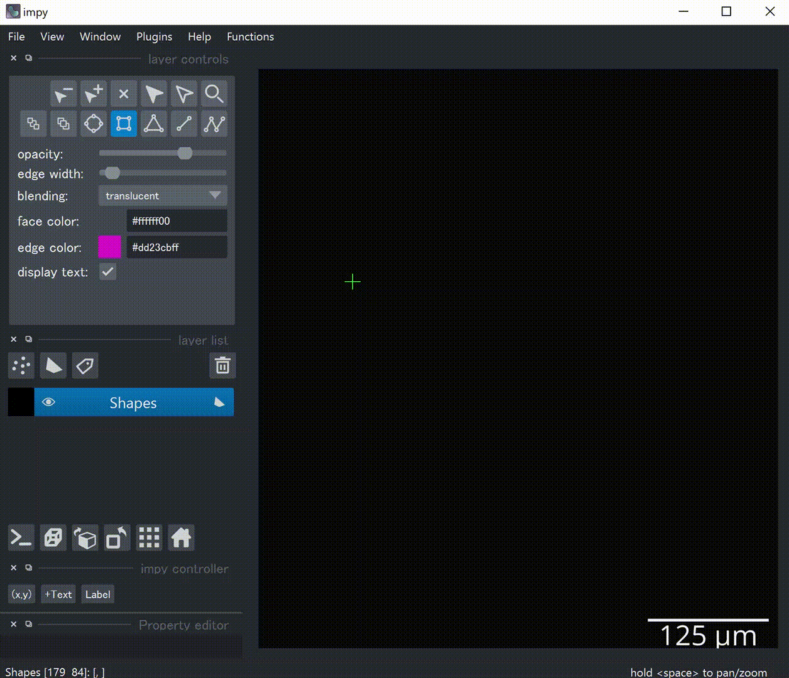

Viewer Tutorial
===============

``impy`` provides simple interaction between console and ``napari.Viewer``. The controller object ``ip.gui`` has
multiple abilities to make your image processing efficient.

Send Data from Console to Viewer
--------------------------------

You can add any objects (images, labels, points, ...) to the viewer by ``ip.gui.add(...)``. ``ip.gui`` can determine 
layer types according to the instance type.

1. Add images

When ``ImgArray``, ``PhaseArray``, ``LazyImgArray``, or path to the image file are given, an ``Image`` layer with 
proper settings will be created. If ``np.ndarray`` or ``dask.array.core.Array`` are given, they will be converted to
plausible array types that are compatible with ``impy`` and similarly send to the viewer.

.. code-block:: python

    import impy as ip

    # Basically you'll run ...
    img = ip.imread("path/to/img.tif")
    ip.gui.add(img)
    
    # This also works
    ip.gui.add("path/to/img.tif")

If ``LazyImgArray`` is given, or a path is given but the image size is too large, then image is loaded as ``dask`` 
array so that it will be viewed as "virtual stack", i.e., read from the disk every time it is needed to. However, 
viewing large images is not as slow as you expect because image data will be cached by methods in ``dask.cache``.

2. Add labels

When ``Label`` or ``ImgArray`` that has ``labels`` attribute are given, a ``Labels`` layer will be created. View 
of labels will be passed to the viewer as ``numpy.ndarray`` so that when either values are changed it will affect 
the other.

.. code-block:: python

    ip.gui.add(img)
    img.labels.delete_label(1) # this affects viewer's labels layer

You can also manually draw a label directly as ``Label`` anchored on ``ImgArray`` by pushing "Label" button on the 
lower-left corner.

3. Add points

When ``MarkerFrame`` or ``TrackFrame`` are given, a ``Points`` layer will be created.

.. code-block:: python

    mols = img.find_sm()    # find single molecules
    ip.gui.add(img)         # add image
    ip.gui.add(mols)        # add points

4. Add table widgets

When ``PropArray`` or ``pandas.DataFrame`` are given, an Excel-like table widget will be added on the right side of 
the viewer. If you want to get coordinates of a ``Points`` layer or ``Tracks`` layer as a table widget, select the 
layer and push the "(x,y)" button on the lower-left corner. This widget comes from generic ``TableWidget`` class, 
which is able to copy data, store data or plot the selected table contents like Excel. It has following buttons.

- "Copy": Copy all the contents into clipboard. You can paste it directly as csv style.

- "Store": Store all the contents as ``pandas.DataFrame`` temporary in ``ip.gui.results``.

- "Plot": Plot selected data on the figure canvas inside ``napari``. One table one canvas.

- "Setting...": Settings of plot, which is the options of ``plot`` function of ``pandas.DataFrame``.

5. Add shapes layer as an text layer

"Text" button on the lower-left corner. You can easily edit the text using the widget "Property Editor".

Get impy Objects from Viewer
----------------------------

The ``napari.Viewer`` object is accessible via ``ip.gui.viewer``, so that basically you can call any method from it.
However, methods that are frequently used are again defined in ``ip.gui``, in a simpler form.

- When you want to get `i`-th layer, you can use ``ip.gui.layers[i]`` instead of ``ip.gui.viewer.layers[i]``. Because 
``impy`` objects such as ``ImgArray`` are directly passed to layer objects, you can recover ``impy`` object by 
``ip.gui.layers[i].data``.

- Especially, 

    - ``ip.gui.images`` returns a list of images in the layer list as ``ImgArray``.

    - ``ip.gui.image_layers`` returns a list of images in the layer list as ``Layers`` objects.

    - ``ip.gui.points`` returns a list of points in the layer list as ``MarkerFrame``.

*Example:* Apply Gaussian filter to the first image in the viewer, and againg send the result to the viewer.

.. code-block:: python

    img_filt = ip.gui.images[0].gaussian_filter()
    ip.gui.add(img_filt)

- When you want to get the `i`-th selected layers' ``impy`` objects, you only have to call ``ip.gui.selection[i]`` 
instead of some long scripts like ``ip.gui.viewer.layers[list(ip.gui.viewer.selection)[i]]``. Property ``ip.gui.selection`` 
returns list of selected ``impy`` objects as a list.

*Example:* Make an image Z-stack from all the selected images in the viewer.

.. code-block:: python

    img_stack = np.stack(ip.gui.selection, axis="z")

Mouse Callbacks
---------------

There are several custom mouse callbacks in addition to the basic ones in ``napari``.

- When you're drawing shapes, you'll find shape information as a text overlay in the upper left corner.

- You can drag shapes with right click.

- ``Alt`` + mouse drag -> lateral translation

- ``Alt`` + ``Shift`` + mouse drag -> lateral translation restricted in either x- or y-orientation (left button or
right button respectively).

- ``Alt`` + mouse wheel -> rescaling

- ``Ctrl`` + ``Shift`` + ``R`` -> reset original states.

Keyboard Shortcuts
------------------

- ``Ctrl`` + ``Shift`` + ``A`` -> Hide non-selected layers. Display all the layers by push again.

- ``Ctrl`` + ``Shift`` + ``F`` -> Move selected layers to front.

- ``Alt`` + ``L`` -> Convert all the shapes in seleted shape-layers into labels of selected image-layers.

- ``Ctrl`` + ``Shift`` + ``D`` -> Duplicate selected layers.

- ``Ctrl`` + ``Shift`` + ``X`` -> Crop selected image-layers with all the rectangles in selected shape-layers. Rotated 
cropping is also supported!

- ``/`` -> Reslice selected image-layers with all the lines and paths in selected shape-layers. Result is stored in 
``ip.gui.results`` for now.

- ``Ctrl`` + ``P`` -> Projection of shape-layers or point-layers to 2D layers.

- ``Ctrl`` + ``G`` / ``Ctrl`` + ``Shift`` + ``G`` -> Link/Unlink layers. Like "grouping" in PowerPoint.

- ``S`` -> Add `n`-D shape-layer.

- ``P`` -> Add `n`-D point-layer.

Functions Menu
--------------

There is a custom menu called "Functions" added in the menu bar.

- "Threshold/Label"

- "Filters"

- "Measure Region Properties"

- "Rectangle Editor"

- "Template Matcher"

- "Function Handler"

Others
------

- Note pad in ``Window > Note``.

- Call ``impy.imread`` in "File > imread ...". Call ``impy.imsave`` in "File > imsave ...".

Fit Custom Functions into GUI
-----------------------------

``impy`` provides easier way to integrate your function to ``napari``. 

- Example 1: Fit filament tips to sigmoid function

.. code-block:: python
    :linenos:

    from scipy.optimize import curve_fit
    import numpy as np

    def model(x, x0, sg, a, b):
        """
        Sigmoid function.
        """
        return a/(1 + np.exp(-(x-x0)/sg)) + b
        
    @ip.gui.bind
    def fit(gui, ax):
        # get line scan from viewer
        img = gui.images[0]            # get the first image
        line = gui.layers[-1].data[-1] # get the last line in the last shapes layer
        scan = img.reslice(line)       # line scan

        # fitting
        xdata = np.arange(len(scan))
        p0 = [len(xdata)/2, 1, np.max(scan)-np.min(scan), np.min(scan)]
        params, _ = curve_fit(model, xdata, scan, p0=p0)

        # plot the raw profile and fit
        ax.plot(scan, color="lime", alpha=0.5)
        ax.plot(model(xdata, *params), color="crimson")
        ax.scatter(params[0], model(params[0], *params), color="crimson", marker="+", s=260)

        return params

.. image:: images/line_scan.gif
