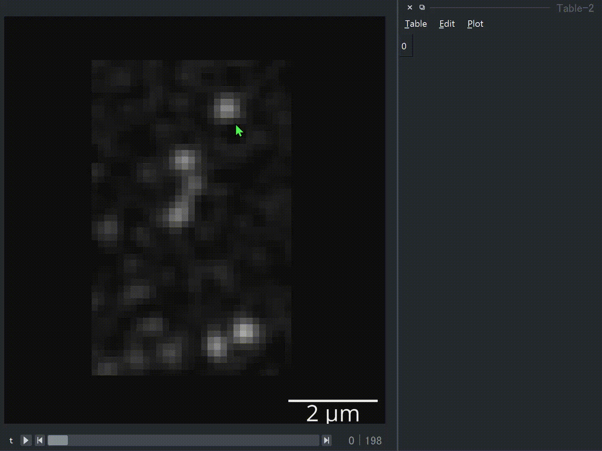
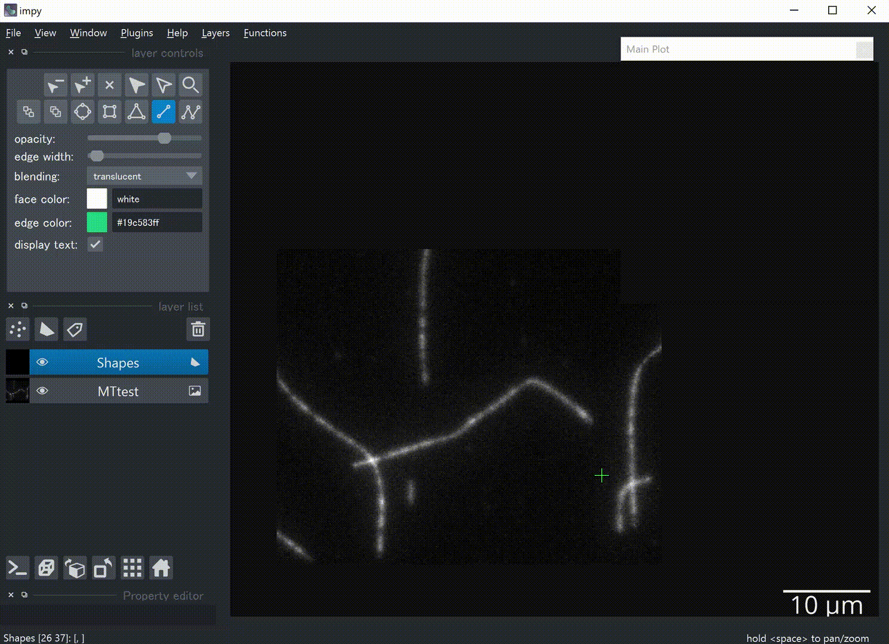
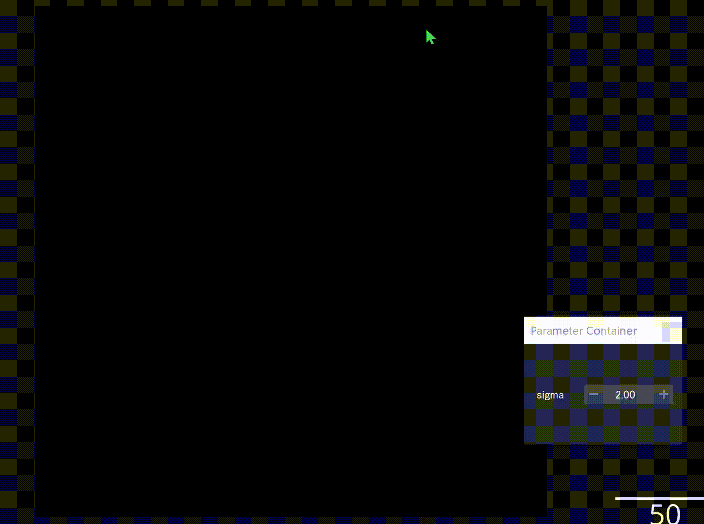

===============
Viewer Tutorial
===============

``impy`` provides simple interaction between console and ``napari.Viewer``. The controller object ``ip.gui`` has
multiple abilities to make your image processing efficient.

``ip.gui`` can have one figure canvas, many tables and one logger, while each table can also have its own figure.

.. blockdiag::
   
   blockdiag {
      
      ip.gui -> viewer;
      viewer [label = "napari.Viewer components + extended functions", width = 360];
      
      ip.gui -> MainFig;
      MainFig [label = "Figure"];
      
      ip.gui -> Explorer;
      
      ip.gui -> Table-0 -> Figure-0;
      ip.gui -> Table-1 -> Figure-1;
      ip.gui -> Table-2 -> Figure-2;
      Table-0 [label = "Table"];
      Figure-0 [label = "Figure"];
      Table-1 [label = "Table"];
      Figure-1 [label = "Figure"];
      Table-2 [label = "Table"];
      Figure-2 [label = "Figure"];
      
      ip.gui -> Logger;
      
      ip.gui [color = pink];
      
   }

These are accessible via attributes of ``ip.gui``.

* ``ip.gui.viewer``: ``napari.Viewer`` object
* ``ip.gui.fig``: ``matplotlib.figure.Figure`` object
* ``ip.gui.table``: ``impy``'s ``TableWidget`` object
* ``ip.gui.log``: ``impy``'s ``LoggerWidget`` object

.. contents:: Contents
    :local:
    :depth: 1

Viewer
======

Send Data from Console to Viewer
--------------------------------

You can add any objects (images, labels, points, ...) to the viewer by ``ip.gui.add(...)``. ``ip.gui`` can determine 
layer types according to the instance type.

1. Add images

When ``ImgArray``, ``PhaseArray``, ``LazyImgArray``, or path to the image file are given, an ``Image`` layer with 
proper settings will be created. If ``np.ndarray`` or ``dask.array.core.Array`` are given, they will be converted to
plausible array types that are compatible with ``impy`` and similarly send to the viewer.

.. code-block:: python

    import impy as ip

    # Basically you'll run ...
    img = ip.imread("path/to/img.tif")
    ip.gui.add(img)
    
    # This also works
    ip.gui.add("path/to/img.tif")

If ``LazyImgArray`` is given, or a path is given but the image size is too large, then image is loaded as ``dask`` 
array so that it will be viewed as "virtual stack", i.e., read from the disk every time it is needed to. However, 
viewing large images is not as slow as you expect because image data will be cached by methods in ``dask.cache``.

2. Add labels

When ``Label`` or ``ImgArray`` that has ``labels`` attribute are given, a ``Labels`` layer will be created. View 
of labels will be passed to the viewer as ``numpy.ndarray`` so that when either values are changed it will affect 
the other.

.. code-block:: python

    ip.gui.add(img)
    img.labels.delete_label(1) # this affects viewer's labels layer

You can also manually draw a label directly as ``Label`` anchored on ``ImgArray`` by pushing "Label" button on the 
lower-left corner.

3. Add points

When ``MarkerFrame`` or ``TrackFrame`` are given, a ``Points`` layer will be created.

.. code-block:: python

    mols = img.find_sm()    # find single molecules
    ip.gui.add(img)         # add image
    ip.gui.add(mols)        # add points

4. Add table widgets

When ``PropArray`` or ``pandas.DataFrame`` are given, an Excel-like table widget will be added on the right side of 
the viewer. If you want to get coordinates of a ``Points`` layer or ``Tracks`` layer as a table widget, select the 
layer and push the "(x,y)" button on the lower-left corner. 

You can also add a new table by calling ``ip.gui.add_table()``

5. Add shapes layer as an text layer

"Text" button on the lower-left corner. You can easily edit the text using the widget "Property Editor".

Get impy Objects from Viewer
----------------------------

The ``napari.Viewer`` object is accessible via ``ip.gui.viewer``, so that basically you can call any method from it.
However, methods that are frequently used are again defined in ``ip.gui``, in a simpler form.

- When you want to get `i`-th layer, you can use ``ip.gui.layers[i]`` instead of ``ip.gui.viewer.layers[i]``. Because 
  ``impy`` objects such as ``ImgArray`` are directly passed to layer objects, you can recover ``impy`` object by 
  ``ip.gui.layers[i].data``.

*Example:* Apply Gaussian filter to the first image in the viewer, and againg send the result to the viewer.

.. code-block:: python

    img_filt = ip.gui.layers[0].gaussian_filter()
    ip.gui.add(img_filt)

- When you want to get the `i`-th selected layers' ``impy`` objects, you only have to call ``ip.gui.selection[i]`` 
  instead of some long scripts like ``ip.gui.viewer.layers[list(ip.gui.viewer.selection)[i]]``. Property ``ip.gui.selection`` 
  returns list of selected ``impy`` objects as a list.

*Example:* Make an image Z-stack from all the selected images in the viewer.

.. code-block:: python

    img_stack = np.stack(ip.gui.selection, axis="z")

- The easiest way to get certain type of layer's data is to use ``ip.gui.get`` method. You can choose layer types such as
  "image", "points" etc., or shapes layer's type such as "rectangle", "line" etc.

*Examples*

.. code-block:: python

    ip.gui.get("image") # get the front image
    ip.gui.get("image", layer_state="selected", returns="all") # get all the selected images as a list
    ip.gui.get("line", layer_state="visible") # get all the lines from the front visible shapes layer.

Get or Set Current Slice
------------------------

We usually want to get a slice of an image stack from the viewer. However, there is no straightforward way to get the image
slice being displayed on the viewer. ``impy`` provides a simple way to do that, with ``ip.gui.current_slice``.

.. code-block:: python

    ip.gui.current_slice # Out: (4, slice(None, None, None), slice(None, None, None))

.. code-block:: python

    # get the front image slice
    ip.gui.get("image")[ip.gui.current_slice]

If you want to go to other view, you can use `ip.gui.goto` method. This method is very simple.

.. code-block:: python

    ip.gui.goto(t=4) # Change t-dimension of current_step to 4 while keep others.

Mouse Callbacks
---------------

There are several custom mouse callbacks in addition to the basic ones in ``napari``.

- When you're drawing shapes, you'll find shape information as a text overlay in the upper left corner.
- You can drag shapes with right click.

.. image:: images/shapes_info.gif

- ``Alt`` + mouse drag -> lateral translation
- ``Alt`` + ``Shift`` + mouse drag -> lateral translation restricted in either x- or y-orientation (left button or
  right button respectively).
- ``Alt`` + mouse wheel -> rescaling
- ``Ctrl`` + ``Shift`` + ``R`` -> reset original states.

Keyboard Shortcuts
------------------

- ``Ctrl`` + ``Shift`` + ``A`` -> Hide non-selected layers. Display all the layers by push again.
- ``Ctrl`` + ``Shift`` + ``F`` -> Move selected layers to front.
- ``Ctrl`` + ``Shift`` + ``D`` -> Duplicate the selected layer. If an image layer is selected, an dialog box opens.
- ``Ctrl`` + ``Shift`` + ``X`` -> Crop selected image-layers with all the rectangles in selected shape-layers. Rotated 
  cropping is also supported!
- ``/`` -> Reslice selected image-layers with all the lines and paths in selected shape-layers. Result is stored in 
  ``ip.gui.results`` for now.
- ``Ctrl`` + ``Shift`` + ``E`` -> Open an explorer widget.
- ``Ctrl`` + ``P`` -> Projection of the selected layer. If an image layer is selected, an dialog box opens.
- ``Ctrl`` + ``G`` / ``Ctrl`` + ``Shift`` + ``G`` -> Link/Unlink layers. Like "grouping" in PowerPoint.
- ``Alt`` + ``Up``/``Down`` -> Change z-focus (overwrote ``napari``'s default because it is errorous)
- ``[``/``]`` -> Go to and focus on previous/next point or shape.

Layers Menu
-----------

Duplicate, crop, project layers and some useful functions are availabel via this custom menu.

Functions Menu
--------------

There is a custom menu called "Functions" added in the menu bar.

- "Threshold/Label": Make binary image or label an image with thresholded binary image by sweeping threshold
  value.
- "Filters": Run filter functions by sweeping the first parameter.
- "Measure Region Properties": Call ``regionprops`` and add the result as properties in ``Label`` layer.
- "Rectangle Editor": Edit selected rectangles pixelwise.
- "Template Matcher": Match a template layer to a reference layer.
- "Function Handler": Call ``impy`` functions inside the viewer.

Others
------

* Note pad in ``Window > Note``.
* Call ``impy.imread`` in "File > imread ...". 
* Call ``impy.imsave`` in "File > imsave ...".
* Call ``pandas.read_csv`` and add an table widget in "File > pandas.read_csv ...".
* Open explorer widget in "File > Open explorer".

|

Figure
======

Interactivity
-------------

When launched from ``impy``, ``napari``'s viewer is implemented with a highly interactive figure canvas. You can drag
the figure with mouse left button, call ``tight_layout`` with double click, resize with wheel and stretch the graph
with mouse right button.

|

How to Use Figure Canvas from Console
-------------------------------------

The backend in ``napari`` is available via ``ip.GUIcanvas``. Only during function call in ``ip.gui.bind``, the backend
is always switched to it. However, You can fully switch to ``ip.GUIcanvas``:

.. code-block:: python

    # change the backend
    import matplotlib as mpl
    mpl.use(ip.GUIcanvas)

    # "plt" in GUI canvas
    plt.figure()
    plt.plot(np.random.random(100))
    plt.show()

Figure is also accessible via ``ip.gui.fig``, so that you can use it without changing the backend.

.. code-block:: python

    ax = ip.gui.fig.add_subplot(111)
    ax.plot(np.random.random(100))
    ip.gui.fig.canvas.draw() # This line is needed to update canvas.
    

Table
=====

Basic usage
-----------

This widget is implemented by the class ``TableWidget``. Unlike the pure ``QTableWidget``, it is much more user friendly.

1. It can have its own figure canvas, independent of that in the viewer. Of course, the canvas is interactive. It is 
   provided as an dock widget of ``TableWidget`` so that you won't be confused when you have a lot of tables.
2. You can edit data and header, plot the selected data, and get access to the whole data from the console.

|

You can find useful function in the menu bar.

* "Table" menu ... This menu contains functions that refer to the table and its contents but do not change the data.
    * "Copy all"/"Copy selected": Copy the contents into clipboard. You can paste it directly as csv style.
    * "Store all"/"Store selected": Store all the contents as ``pandas.DataFrame`` temporary item in ``ip.gui.results``.
    * "Resize": Resize column width to fit the contents.
    * "Restore linked layer": Add linked layer if it was deleted from the layer list.
    * "Delete widget": Delete table from the viewer. Figure canvas will also be deleted.

* "Edit" menu ... This menu contains functions that will change the contents of the table.
    * "Header to top row": Move the header to the top of the table. New header will be named with sequential integers.
    * "Append row": Add a new row in the bottom.
    * "Append column": Add a new column on the right.
    * "Delete selected rows": Delete all the rows that selected cells exist. Index number will **NOT** be renamed.
    * "Delete selected columns": Delete all the columns that selected cells exist. Index number will **NOT** be renamed.

* "Plot" menu ... This menu contains functions that can plot the contents of the table.
    * "Plot": Plot selected data on the figure canvas, as a dock widget in the table widget.
    * "Histogram": Show histogram of selected data on the figure canvas, as a dock widget in the table widget.
    * "Setting ...": Settings of plot, which is the options of ``plot`` and ``hist`` function of ``pandas.DataFrame``.

The lastly added table is accessible via ``ip.gui.table``. You can append data by calling ``ip.gui.table.append(...)``.

Link table with layers
----------------------

Just like ImageJ ROI manager, you usually want to link shapes/points, their properties and table rows. For instance, you
may want to add rectangles in a shapes layer, measure the mean intensity of an image for each rectangle and store the
measurement results in a table to see or plot the results.

``impy`` provides useful functions for this purpose. You can add shapes/points and at the same time append a 1-D data to
the bottom of a table. They are linked to each other so that you can jump to any shapes/points by double-clicking one of
the table rows.

.. code-block:: python
    
    # Like "append" function ...
    ip.gui.table.append({"ID": 0, "value": 0.5})

    # ... you can add a point and link it to a table row
    ip.gui.register_points([0, 0],          # Point coordinate. By default the cursor position will be added.
                           face_color="yellow",
                           edge_color="white", 
                           properties={"ID": 0, "value": 0.5} # This dictionary will be appended to a table.
                           )
    # ... or add a line and link it to a table row
    ip.gui.register_points([[0, 0], [100, 50]], # Shape data. By default the cursor position will be added.
                           shape_type="line", 
                           face_color="yellow",
                           edge_color="white", 
                           properties={"ID": 0, "value": 0.5} # This dictionary will be appended to a table.
                           )

See examples and GIF in "Plug Custom Functions into GUI" section below.

Logger
======

``impy``'s viewer also provides a logger widget, which would be useful to print some information. It is accessible via
``ip.gui.log``. You can append log by calling ``ip.gui.log.append(...)``.

If you want to show all the printed strings in the logger, you can use context manager ``ip.setLogger``.

.. code-block:: python

    import logging

    with ip.gui.use_logger():
        # both will be printed in the viewer's logger widget
        print("something")
        logging.warning("WARNING")

Explorer
========

You can open a read-only explorer widget inside the viewer, from "File" menu or shortcut "Ctrl+Shift+E". From the 
explorer you can open files by double-clicking them, or filter files with wildcard strings. When a file is copied
by "Ctrl+C" its absolute path is always copied to the clipboard.

Text File Viewer
================

When you double-clicked a txt file in the explorer, a read-only text file viewer widget is added to the viewer. You can
search by words or regular expressions in the widget. This widget is very useful when you want to view an image file and
refer to its metadata file at the same time.

Plug Custom Functions into GUI
==============================

In image analysis, you usually want to set parameters using manually drawn shapes or points. You don't have
to do that by getting properties of the viewer for every function call. ``impy`` provides easier way to integrate 
your function to ``napari``. Just decorate your function with `@ip.gui.bind` and call function with keybind "F1". 
Of course, abovementioned figure canvas, table, logger are all accessible during function calls. Fully utilize them
to make your plugin nice.

Examples
--------

1. Marking single molecule movie with centroid-aided auto centering.

This is the most simple but practical example. Regsiter centroid with ``register_point`` function, and you can jump
to any points by double-clicking table rows.

.. code-block:: python

    from skimage.measure import moments

    @ip.gui.bind
    def func(gui):
        # Get cursor position
        # Because we want to mark in 2D, we have to split (x,y) from others.
        img = gui.get("image")
        *multi, y, x = gui.cursor_to_pixel(img)

        # Get 2D image around cursor by slicing with "gui.current_slice"
        y0 = y-4
        x0 = x-4
        img0 = img[gui.current_slice][y0:y0+9, x0:x0+9]
        img0 = img0 - img0.mean()    # normalize

        # calculate centroid
        M = moments(img0.value)
        cy, cx = M[1, 0]/M[0, 0] + y0, M[0, 1]/M[0, 0] + x0

        point = multi + [cy, cx]

        gui.register_point(point, properties={"x":cx, "y":cy})

        return None

|

2. Fit filament tips to sigmoid function

This is an example of binding a function with plot function. A figure canvas will be automatically generated.
Because ``plt.figure`` will be called for every function call, figure canvas is cleared every time you push "F1".

.. code-block:: python

    from scipy.optimize import curve_fit
    import numpy as np

    def model(x, x0, sg, a, b):
        """
        Sigmoid function.
        """
        return a/(1 + np.exp(-(x-x0)/sg)) + b
        
    @ip.gui.bind
    def fit(gui):
        # get line scan from viewer
        img = gui.get("image")      # get the first image
        line = gui.get("line")      # get the last line in the last shapes layer
        scan = img.reslice(line)    # line scan

        # fitting
        xdata = np.arange(len(scan))
        p0 = [len(xdata)/2, 1, np.max(scan)-np.min(scan), np.min(scan)]
        params, _ = curve_fit(model, xdata, scan, p0=p0)

        # plot the raw profile and the fitting result
        plt.figure()
        plt.plot(scan, color="lime", alpha=0.5)
        plt.plot(model(xdata, *params), color="crimson")
        plt.scatter(params[0], model(params[0], *params), color="crimson", marker="+", s=260)
        plt.show()
        return params

|

3. Draw Gaussian points with different sizes

``ip.gui.bind`` also supports calling functions with additional parameters. ``magicgui.widgets.create_widget`` 
is called inside to infer proper widgets to add, so that in this case you must annotate all the additional 
parameters. The example below also shows that updating data inplace immediately updates layers as well.

.. code-block:: python

    import numpy as np

    @ip.gui.bind
    def draw_gaussian(gui, sigma:float=2):
        img = gui.get("image")
        y, x = np.indices(img.shape)
        my, mx = gui.viewer.cursor.position
        gauss = np.exp(-((x-mx)**2 + (y-my)**2)/sigma**2)
        img += gauss

|

Plugin Protocols
================

In image analysis, several steps of different manual operation are often needed. You have to add instructions, make 
new widgets and implement all the probable error handlings.

In ``impy``, you can make this kind of image analysis, here I call "protocol", much more easily than ever. ``ip.gui``'s
decorator method ``bind_protocol`` provides several functions that cover most of demands in terms of making plugin that
people won't have difficulty using it.

First you have to make a "protocol function" that will yield functions as a generator.

.. code-block:: python

    @ip.gui.bind_protocol
    def protocol(gui):
        def step1(gui, param1=1, string="name"):
            ...
        # do step-1 twice
        yield step1
        yield step1

        def step2(gui, param2=3.0):
            ...
        # do step-2 once
        yield step2
        
        # end protocol
        return ...

In this most basic form, every time you push "F1", functions are called one by one. Widgets that enable parameter 
input will be prepared every time new function is generated. 

If your analysis is a little bit complicated, you may want to add instructions for each step. It can be achieved by
writing docstring to each function.

.. code-block:: python

    @ip.gui.bind_protocol
    def protocol(gui):
        def step1(gui, param1=1, string="name"):
            """
            This is docstring.
            In this step, do something and something.
            And push "F1"
            """
            ...    
        
However, it is still not enough. For instance, with these options you'll be at a loss when you need to implement
function "choose as many points as you want, and go to next step". Apparently you need at least two buttons. To
achieve this, ``bind_protocol`` prepares two keys: "F1" for mainly running same step while "F2" for proceeding to next
step. Which button you pushed can be distinguished by ``ip.bui.proceed`` attribute. It takes ``False`` if "F1" is 
pushed while takes ``True`` otherwise. Now, functions "know" whether you want to proceed or not.

.. code-block:: python

    @ip.gui.bind_protocol
    def protocol(gui):
        pos = []
        def get_cursor_position(gui):
            if not gui.proceed: # This "if" is necessary if you don't want to call function when "F2" is pushed
                pos.append(gui.cursor_pos)
        
        while not gui.proceed: # Repeat until "F2" is pushed
            yield get_cursor_position
        
        # next step ...

Here's a practical example. This class is designed to conduct following analysis:

1. Manually select `(x, y)` coordinates.
2. Select target image.
3. Label selected image ``radius`` pixels around coordinates.
4. Measure time-series mean intensity changes int each label.

.. code-block:: python

    class Measure:
        def __init__(self):
            self.image = None
            self.labels_layer = None

        def select_molecules(self, gui):
            """
            Add markers with "F1".
            Go to next step with "F2".
            """
            if gui.proceed:
                return
            gui.register_point(gui.cursor_pos[-2:])

        def select_image(self, gui):
            """
            Select target image and push "F1".
            """
            self.image = gui.get("image", layer_state="selected")

        def label(self, gui, radius:float=3):
            """
            Set proper radius to label around markers.
            Push "F1" to preview.
            Push "F2" to apply.
            """
            coords = gui.table.linked_layer.data.astype(np.int32)
            kwargs = {"radius":radius, "labeltype":"circle"}
            if self.labels_layer is not None:
                self.image.specify(coords, **kwargs)
                self.labels_layer.data = self.image.labels
            else:
                self.image.specify(coords, **kwargs)
                gui.add(self.image.labels)
                self.labels_layer = gui.layers[-1]

        def measure(self, gui):
            gui.add(self.image.regionprops().mean_intensity)

Using this class, we can make a protocol using only ~10 lines. The comment out ``# gui table`` is a mere trick.
Because ``ip.gui.bind_protocol`` determines whether add a table widget before you actually need it by looking
over the source code and find "gui.table" ("gui" may vary depending on your definition of the protocol function).
Since it is hidden in the class method, we have to "tell" it we use table widgets to avoid tables suddenly appear. 

.. code-block:: python

    @ip.gui.bind_protocol
    def func(gui):
        # gui.table
        m = Measure()
        while not gui.proceed:
            yield m.select_molecules
        yield m.select_image
        while not gui.proceed:
            yield m.label
        m.measure(gui)

.. image:: images/protocol.gif